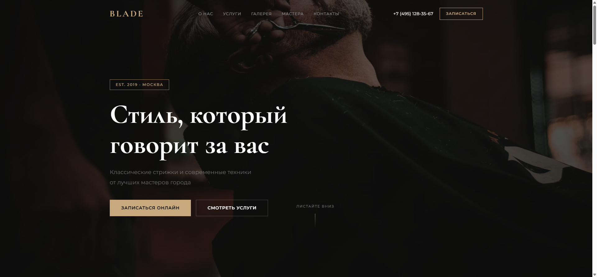

# ✂️ BLADE — Лендинг барбершопа

> Лендинг для премиального барбершопа с формой онлайн-записи и галереей работ.



## 🛠 Стек

- HTML5 (семантическая вёрстка)
- CSS3 (Custom Properties, Grid, Flexbox, анимации)
- JavaScript (Intersection Observer, FormData, валидация)
- Шрифты: Cormorant Garamond + Montserrat (Google Fonts)

## ✨ Особенности

- Полностью адаптивный дизайн (mobile-first)
- Тёмная цветовая схема с золотыми акцентами
- Параллакс-эффект на hero-секции
- Анимации появления при скролле (Intersection Observer)
- Анимированные счётчики статистики
- Masonry-сетка галереи
- Форма записи с валидацией на клиенте
- Мобильное бургер-меню
- Интеграция Яндекс Карт
- Модальное окно подтверждения записи
- Lighthouse 90+ (SEO, Accessibility)

## 🚀 Демо

[👉 Смотреть демо](https://username.github.io/blade-barbershop)

## 📸 Скриншоты

| Desktop | Mobile |
|---------|--------|
|  |  |

## 📦 Запуск

```bash
# Клонирование
git clone https://github.com/username/blade-barbershop.git
cd blade-barbershop

# Вариант 1: открыть напрямую
start index.html

# Вариант 2: через локальный сервер (рекомендуется)
npx http-server -p 8080 -c-1
# Открыть http://localhost:8080
```

## 📁 Структура проекта

```
blade-barbershop/
├── index.html          # Разметка страницы
├── style.css           # Стили (CSS Custom Properties)
├── script.js           # Логика (анимации, форма, меню)
├── screenshots/        # Скриншоты для README
│   ├── hero-desktop.png
│   └── full-page.png
└── README.md
```

## 📄 Лицензия

MIT
