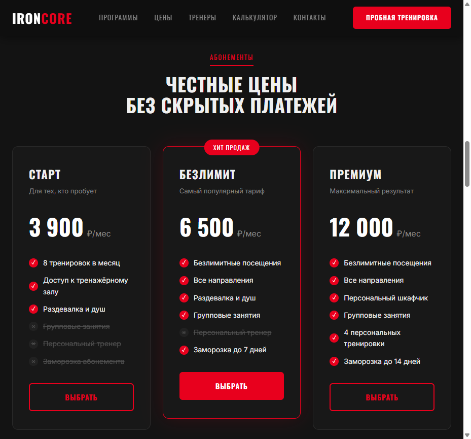

# 💪 IRONCORE — Лендинг фитнес-студии

> Лендинг для фитнес-студии с рабочим калькулятором калорий и формой записи.



## 🛠 Стек

- HTML5 (семантическая вёрстка)
- CSS3 (Custom Properties, Grid, анимации)
- JavaScript ES6+ (калькулятор BMR, маска телефона, валидация)
- Шрифты: Oswald + Inter (Google Fonts)

## ✨ Особенности

- Агрессивный дизайн: чёрный + неоновый красный
- 6 карточек направлений (силовые, кроссфит, бокс, йога, стретчинг, функциональный)
- Таблица тарифов с выделенным «хитом продаж»
- **Калькулятор калорий** по формуле Миффлина — Сан-Жеора (BMR + TDEE с целями)
- Маска ввода телефона
- Форма пробной тренировки с валидацией
- Анимации появления при скролле (Intersection Observer) с каскадной задержкой
- Мобильное меню, полная адаптивность

## 🚀 Запуск

```bash
# Переходим в папку
cd portfolio/landings/02-fitness

# Открываем через локальный сервер
npx -y http-server -p 8081 -c-1
# Открыть: http://localhost:8081
```

## 🧮 Как работает калькулятор

Используется формула Миффлина — Сан-Жеора:

- **Мужчины:** `BMR = 10 × вес + 6.25 × рост − 5 × возраст + 5`
- **Женщины:** `BMR = 10 × вес + 6.25 × рост − 5 × возраст − 161`
- **TDEE** = BMR × коэффициент активности (1.2 – 1.9)
- **Похудение** = TDEE × 0.8 (дефицит 20%)
- **Набор массы** = TDEE × 1.15 (профицит 15%)

## 📁 Структура

```
02-fitness/
├── index.html      # Разметка
├── style.css       # Стили
├── script.js       # Логика (калькулятор, маска, форма, меню)
├── screenshots/
│   ├── hero-desktop.png
│   ├── pricing.png
│   ├── calc-result.png
│   └── modal-success.png
└── README.md
```

## 📄 Лицензия

MIT
